# FraudForge: Agentic Autodata for BIAN Fraud Evaluation

[](https://github.com/cognitive-builder/fraud-detection-python/actions/workflows/fraudforge-ci.yml)
[](LICENSE)
[](https://bian.org/)

**FraudForge** is a reproducible, CPU-friendly implementation of the central idea in
[Autodata: an agentic data scientist to create high-quality synthetic data](https://arxiv.org/abs/2606.25996),
centered on the BIAN **Fraud Evaluation** service domain.

Instead of generating a dataset once and hoping it is useful, FraudForge closes the loop:

1. **Ground** the task in a BIAN-aligned fraud-evaluation schema and scenario catalog.
2. **Generate** fictional transactions from a mutable recipe.
3. **Challenge** a bounded weak rule solver and a stronger model ensemble.
4. **Verify** planted evidence, constraints, duplication, and fraud-family coverage.
5. **Analyze** whether examples are too easy, too hard, too noisy, or too repetitive.
6. **Revise** ambiguity, signal strength, noise, hard negatives, and scenario mixture.
7. **Select** a batch inside a bounded “just-right” learning-signal region.
8. **Export** experiences, rollouts, preference pairs, verifier records, rubrics, BIAN payloads,
   and recipe trajectories.

> The default demo uses no external LLM and no API key. Deterministic verification is the primary
> oracle; the control loop remains inspectable and inexpensive enough for a Hugging Face CPU Space.

## Why BIAN Fraud Evaluation?

BIAN describes Fraud Evaluation as the capability that executes fraud behavioral-pattern tests to
identify potentially fraudulent activity. Its API distinguishes **Rule Sets and Decision Trees**
from **Models**, providing an unusually clean mapping to the paper’s weak/strong solver pattern.
Fraud data is also long-tailed, costly to label, privacy-sensitive, and full of decision-boundary
cases—conditions under which adaptive synthetic data is more useful than a static generator.

## What the demo includes

| Capability | Implementation |
|---|---|
| Main data-scientist agent | `AutodataOrchestrator` |
| Challenger | `SyntheticTransactionGenerator` plus mutable `Recipe` |
| Weak solver | transparent fraud rules with deliberately bounded coverage |
| Strong solver | calibrated Extra Trees ensemble with broader relational/context features |
| Verifier/Judge | deterministic schema and planted-signature oracle |
| Inner optimization | feedback-driven recipe revision |
| Outer optimization | held-out evolutionary recipe search over multiple seeds |
| Dataset-level quality | coverage, duplication, validity, specificity, score variance |
| Downstream test | fixed learner before/after curriculum enrichment on shifted holdout |
| Banking contract | BIAN-aligned `/FraudEvaluation/Evaluate` API and payloads |
| Demo UI | Gradio trajectory, diagnostics, BIAN payload, and ZIP export |

## Architecture

```mermaid
flowchart LR
    G[BIAN grounding + scenario catalog] --> C[Challenger / generator]
    C --> D[Synthetic transaction batch]
    D --> W[Weak rule solver]
    D --> S[Strong model solver]
    D --> V[Deterministic verifier]
    W --> A[Data-scientist analyzer]
    S --> A
    V --> A
    A -->|too easy / too hard / noisy / repetitive| R[Revise recipe]
    R --> C
    A -->|all gates pass| E[Accepted dataset bundle]
    E --> B[BIAN Fraud Evaluation API]
    E --> T[RL / SFT / evaluation artifacts]
    M[Held-out meta-search] -. optimizes recipe policy .-> R
```



## Quick start

```bash
python -m venv .venv
source .venv/bin/activate        # Windows: .venv\Scripts\activate
pip install -e .
python -m fraudforge --output artifacts/latest
```

Run the Gradio application:

```bash
python app.py
```

Run the BIAN-aligned API:

```bash
uvicorn api:app --host 0.0.0.0 --port 8000
```

Then evaluate a production-shaped transaction set with:

```text
POST /FraudEvaluation/Evaluate
```

Run tests:

```bash
pip install -e .[dev]
pytest -q
```

## Default acceptance gates

The agent does **not** maximize difficulty. It searches for a bounded curriculum:

| Gate | Default target |
|---|---:|
| deterministic validity | ≥ 98.5% |
| weak recall | 25%–60% |
| strong recall | ≥ 82% |
| strong-minus-weak recall gap | 16%–58% |
| strong false-positive rate | ≤ 12% |
| fraud-family coverage | ≥ 95% |
| duplicate rate | ≤ 1.5% |
| weak-score standard deviation | ≥ 0.08 |
| strong-win preference-pair rate | ≥ 6% |

These gates operationalize a key finding from the paper: a useful agent may need to make examples
harder **or easier** depending on weak-solver reward variance.

## Generated artifact contract

A successful run produces:

```text
transactions.csv / transactions.parquet
experience.jsonl
sft_examples.jsonl
rollouts.jsonl
preference_pairs.jsonl
verifiers.jsonl
fixture_generators.jsonl
rubric_items.jsonl
recipe.json
recipe_trajectory.csv
family_metrics.csv
metrics.json
downstream_utility.json
bian_request.json
bian_response.json
manifest.json
```

The structure borrows useful ideas from
[`verified-analytics-tasks`](https://huggingface.co/datasets/Eve39570/verified-analytics-tasks)—
especially deterministic checkers, seeded fixtures, trap-aware evaluation, and separate
experience/rollout/preference/verifier tables—and from
[`vi-gsm8k-agentic`](https://huggingface.co/datasets/vuongtsc/vi-gsm8k-agentic)—
especially the Challenger/Weak/Strong/Verifier gate, code-first verification, deduplication, and
held-out testing.

## How the supplied policy model informs this project

[`ligaments-dev/autodata-policy-cs`](https://huggingface.co/ligaments-dev/autodata-policy-cs) is
reviewed as an engineering lesson rather than loaded into the banking runtime. Its model card
reports a small infrastructure-validation run whose reward did not trend upward, with five useful
prompts and completion-termination/reward issues. FraudForge therefore keeps reward components
visible, validates across held-out seeds, and treats “the pipeline ran” as different from “the
policy learned.” A policy-model integration becomes meaningful after a bank-specific trajectory
corpus exists.

## Documentation

- [Paper and asset review](docs/paper-review.md)
- [Architecture and control loop](docs/architecture.md)
- [BIAN use case and API mapping](docs/bian-use-case.md)
- [Implementation guide](docs/implementation.md)
- [Evaluation and experiment design](docs/evaluation.md)
- [Governance and responsible use](docs/governance.md)
- [GitHub Pages and Hugging Face deployment](docs/deployment.md)
- [Social launch pack](social/README.md)

## Scope

FraudForge is an evaluation and demonstration environment. It contains no real customer data and
does not execute payment decisions. Production adoption requires institution-specific validation,
model-risk governance, privacy/fairness review, human escalation, monitoring, and integration with
adjacent capabilities such as Fraud Diagnosis and Fraud Resolution.

## Attribution

- Autodata paper: Meta FAIR and collaborators, arXiv:2606.25996.
- BIAN semantic API concepts: BIAN public artifacts.
- Referenced Hugging Face model and datasets retain their respective licenses and attribution.
- FraudForge code: Apache-2.0.
