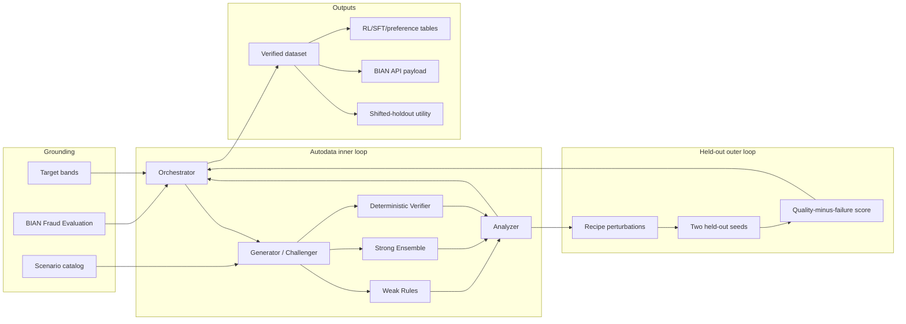

# Architecture and control loop

## Component view

## Recipe state

The mutable policy contains:

- fraud prevalence;
- ambiguous-case rate;
- planted-signal strength;
- feature-noise rate;
- legitimate hard-negative rate; and
- probability weights for seven fraud families.

This is the demo’s equivalent of the challenger prompt. It is explicit, serializable, diffable, and
safe to expose in a public repository.

## Inner-loop decision logic

1. Generate a batch using the current recipe and round-specific seed.
2. Recompute fraud signatures without reading the oracle label.
3. Score the verified rows with the weak rule engine and strong ensemble.
4. Calculate task and dataset metrics.
5. Accept only if every target-band gate passes.
6. Otherwise generate textual diagnostics and revise the recipe.
7. Optionally run held-out candidate search before the next round.

Typical revision actions:

| Observation | Recipe response |
|---|---|
| weak recall too high | more ambiguity, less signal strength, more hard negatives |
| weak recall too low | less ambiguity, stronger planted signals, less noise |
| strong recall too low | reduce noise/ambiguity and reinforce signatures |
| too few strong-win pairs | up-weight families producing more strong-only successes |
| duplicate rate high | reject batch; generator changes are required |

## Why the weak solver is a rule engine

The BIAN Fraud Evaluation API explicitly represents rule-set/decision-tree tests and model tests as
separate behavior qualifiers. A rule engine is therefore more than a convenient baseline: it is a
natural BIAN mapping and a realistic proxy for an installed bank control that is precise but
coverage-limited.

## Why the strong solver is not the oracle

The strong model can still be wrong. Labels come from planted scenario semantics checked by a
programmatic verifier. This separation avoids circular evaluation in which a model creates data,
labels it, and then grades itself.

## Data lineage

Every accepted row can be linked to:

- the generation recipe and selected round;
- its planted scenario and reason code;
- deterministic evidence flags;
- weak and strong scores/decisions;
- verifier result and duplicate fingerprint; and
- preference/SFT/rollout representations.

This lineage is essential for model-risk review and is intentionally preserved in human-readable
JSONL and CSV files.
