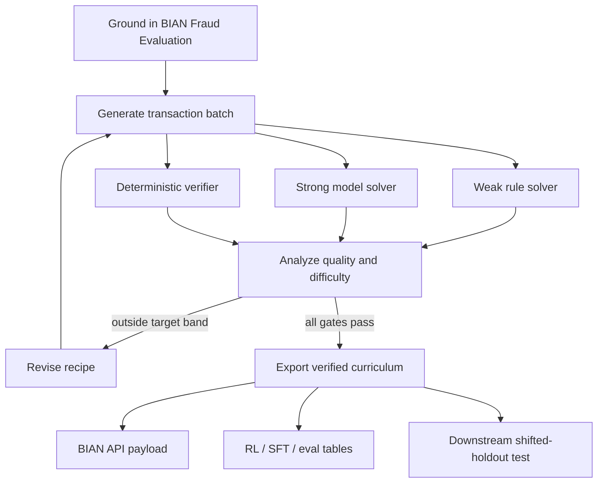

# FraudForge Autodata Lab

**FraudForge** turns the Autodata paper’s core idea into a complete banking demonstration: an
agentic data scientist iteratively builds and validates synthetic data for the BIAN **Fraud
Evaluation** service domain.

The project is designed around one claim: synthetic-data quality cannot be reduced to realism,
volume, or difficulty. The useful objective is **learning signal**. A batch is valuable when it is
valid, diverse, behaviorally meaningful, learnable by the target system, and discriminative enough
to expose capability gaps.

## What happens in one run



## Key properties

- **Fully fictional data.** No customer or bank records are needed.
- **Deterministic oracle.** Planted evidence is checked without trusting a model judge.
- **Bounded difficulty.** The loop can make data easier or harder to preserve usable variance.
- **Weak/strong separation.** Transparent rules play the weak solver; a contextual ensemble plays
  the strong solver.
- **Dataset-level controls.** Coverage, duplicate rate, validity, false positives, score variance,
  and preference-pair yield are visible.
- **Held-out outer loop.** Recipe changes are compared on separate seeds before being selected.
- **Banking interoperability.** The API follows the key concepts of BIAN Fraud Evaluation.
- **Deployable.** Gradio, FastAPI, Docker, GitHub Actions, GitHub Pages, and Hugging Face Space
  packaging are included.

## Quick start

```bash
pip install -e .
python -m fraudforge --output artifacts/latest
python app.py
```

For the full reasoning behind the implementation, begin with the [research review](paper-review.md).
